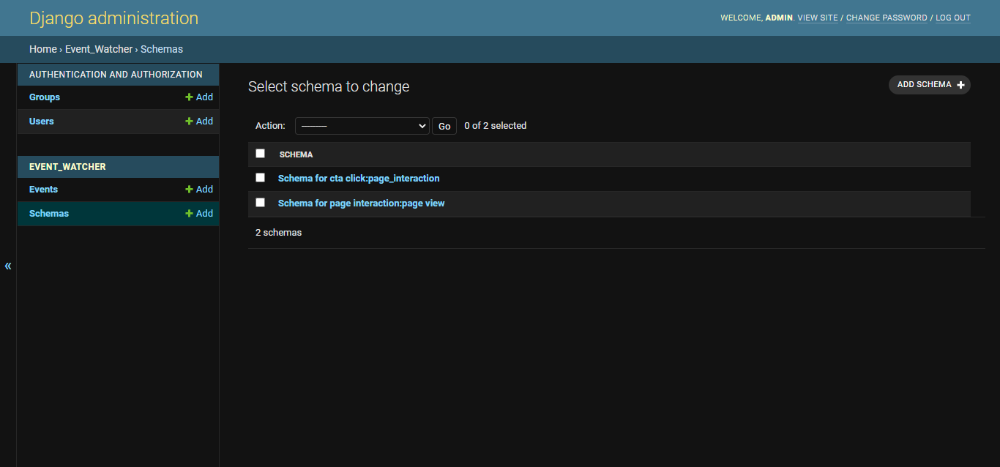
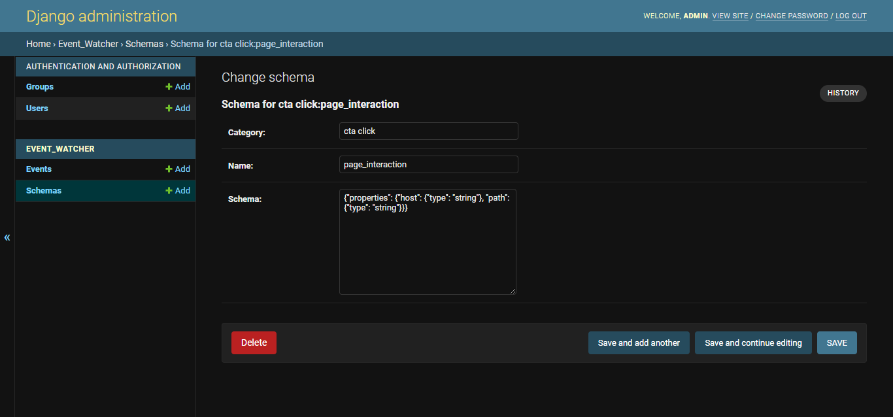
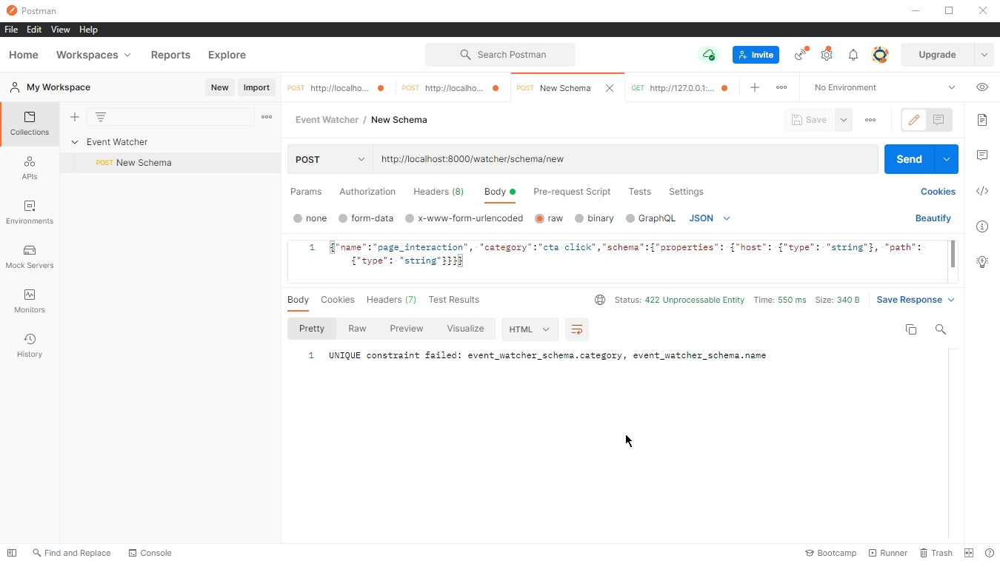
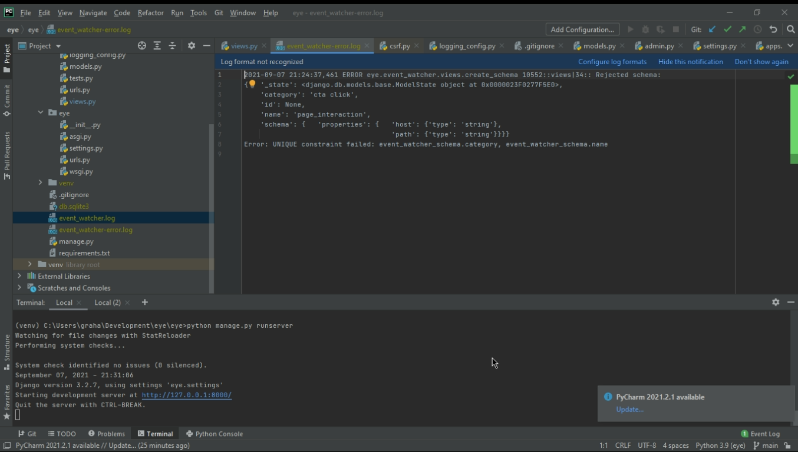
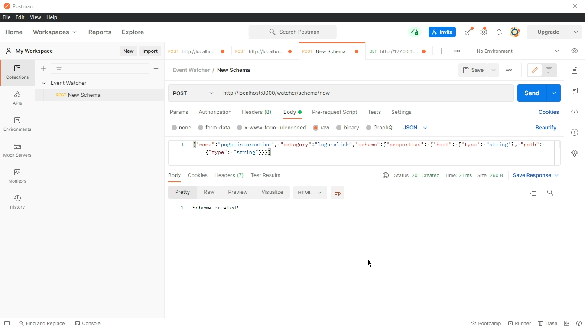
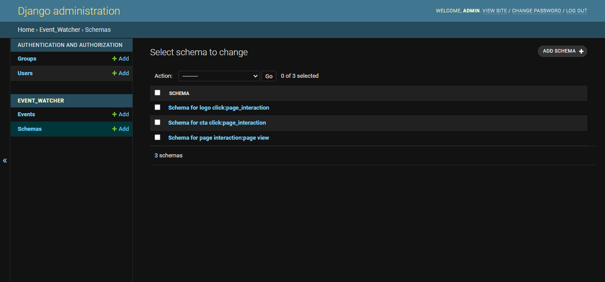

# EventWatcher
This system is intended to verify events which are sent to it by clients and store valid events in a database.

## Endpoints

### watcher/schema/new (POST)
Allows the client to register a new event `schema` with a `category` and `name` by posting them to this endpoint as JSON.

### watcher/event/new (POST)
Allows the client to report one or more events by posting them to this endpoint as a JSON list. Each element in the list must have a 
`session_id`, `timestamp`, `category`, `name`, and a `data` property with a value set which is valid according to the schema indicated by 
`category` and `name`.

- Invalid events (events which do not match their corresponding schema) will be logged to `event-watcher_error.log`.

## Project Status
### watcher/schema/new
New schemas can be added via Postman as seen below. Schemas with a `category` and `name` which already exists in the Schemas table are rejected and the error is logged as seen below.

### watcher/event/new
I have written the logic to validate incoming events with their schemas, but the endpoint is not currently working and I have not yet had time to debug it. It is also sychronous
at present which will not work well with large numbers of events. The code to create events asynchronously is commented-out as I am unable to run Django asynchronously on my 
Windows computer.

## Screenshots

_Viewing existing schemas_

_Schema details_

_Attempting to create an invalid schema with Postman_

_Log entry of an invalid schema event_

_Creating a valid schema with Postman_

_New schema in database_

